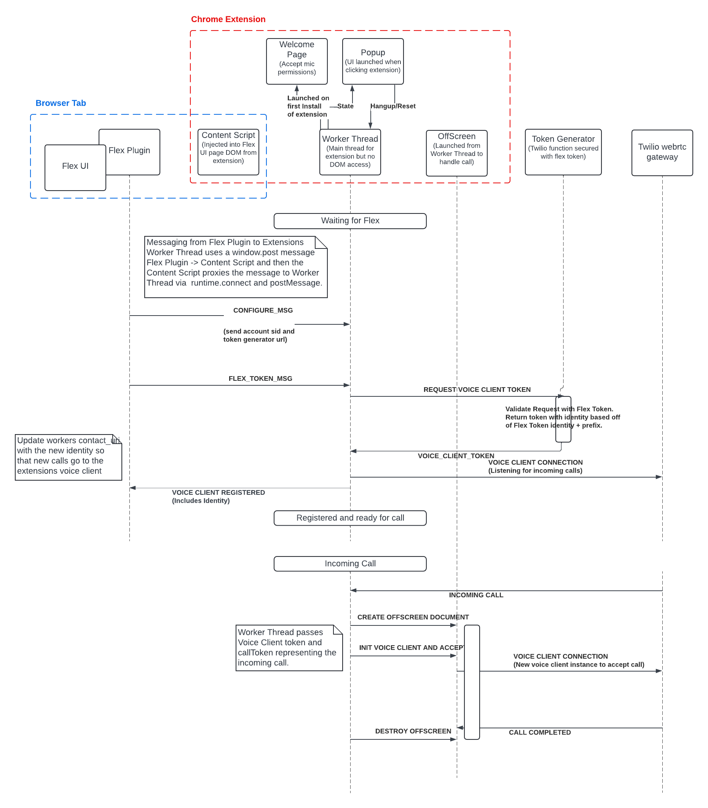

# Flex Voice Client in a Chrome Extension

## Disclaimer

**This software is to be considered "sample code", a Type B Deliverable, and is delivered "as-is" to the user. Twilio bears no responsibility to support the use or implementation of this software.**

**The software is still in a developmental or beta stage and may contain bugs, defects, or other issues that could cause it to malfunction or fail.**

## Testing Requirements

**Before deploying this plugin in a production environment, it is crucial that you perform thorough testing in a controlled, non-production setting. Testing should include resilience to network interruption and token expiry.**

## Chrome/Browser support

TODOD

# Solution Overview

# Installation

## Chrome Extension Install For Development

Deployment strategies are discussed below. For initial development/testing we recommend deploying manually by entering _chrome://extensions/_ in a new browser tab as described here:
https://developer.chrome.com/docs/extensions/get-started/tutorial/hello-world#load-unpacked

The directory to navigate to in the repo to load would is the root of the extension/app directory.

## TaskRouter Workspace Configuration

If the voice client is not available and the agent is in an available activity they will be moved to a configurable activity. We recommend naming the activity 'Voice Client Offline'.

The activity can be added using Twilio Console -> TaskRouter -> Flex Workspace -> Activities and note the name used as it will be required as a environment variable for the Flex UI plugin.

## Serverless Install

> Serverless installs a Twilio Functions serverless environment that the Chrome Extensions leverages to generate a voice client token for use by the voice client sdk.

> The accounts main auth token and account sid is used to validate that the request included a Flex Token. A standard API key is used to generate the voice client access token.

Copy the .env-template in the serverless directory to .env and update the following variables:

```
ACCOUNT_SID=ACxx
AUTH_TOKEN=
API_KEY=SKxx
API_SECRET=
```

Account sid and auth token are available from the Twilio Console -> Account info : https://console.twilio.com/

API key and secret can be created via Console -> Account -> API Keys and Tokens: https://console.twilio.com/us1/account/keys-credentials/api-keys

https://www.twilio.com/docs/iam/api-keys

After updating the .env file deploy using the twilio cli:

```
twilio serverless:deploy
```

Note the domain and full url to the generateToken function as this full url will be required as an environment variable for the Flex UI plugin.

_https://serverless-chrome-extension-flex-voice-client-1234-dev.twil.io/generateToken_

## Flex UI Plugin Install

The Flex UI Plugin can be run locally or deployed to your Twilio account as described here:
https://www.twilio.com/docs/flex/developer/plugins/cli/reference

Note the manifest.json file in the extension/app directory supports the Flex UI plugin running from localhost:3000 or flex.twilio.com. If you are running Flex UI locally on a different port the manifest.json file can be updated as required.

Before running or deploying the Flex UI plugin the .env-template file should be copied to .env and environment variables updated as noted in the TaskRouter Workspace Configuration section and the Serverless Install.

```
FLEX_APP_OFFLINE_VOICE_CLIENT_ACTIVITY_NAME="Voice Client Offline"
FLEX_APP_VOICE_CLIENT_TOKEN_GENERATOR_URL="http://127.0.0.1:3001/generateToken" (or if the service is deployed update to the full url for the generateToken function for the service)
```

# Architecture


