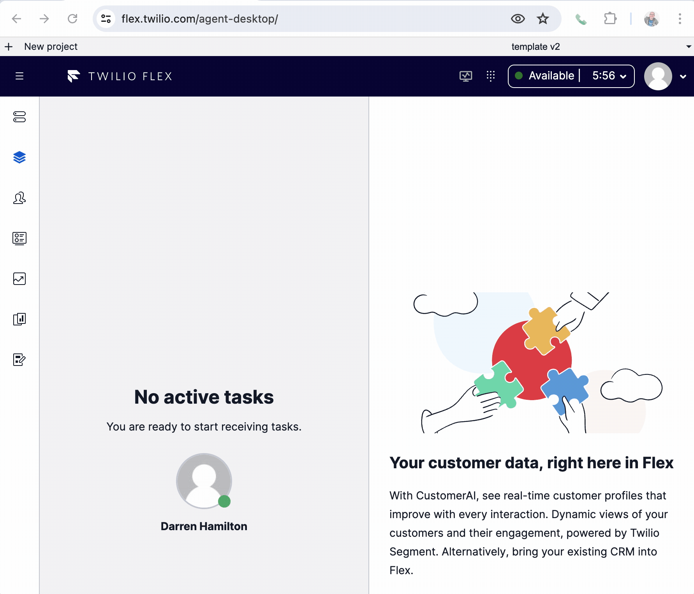

# Flex Voice Client in a Chrome Extension

## Disclaimer

**This software is to be considered "sample code", a Type B Deliverable, and is delivered "as-is" to the user. Twilio bears no responsibility to support the use or implementation of this software.**

**The software is still in a developmental or beta stage and may contain bugs, defects, or other issues that could cause it to malfunction or fail.**

## Testing Requirements

**Before deploying this plugin in a production environment, it is crucial that you perform thorough testing in a controlled, non-production setting. Testing should include resilience to network interruption and token expiry.**

## Chrome/Browser support

To date, the extension has only been tested on _Mac, Chrome Version 126.0.6478.57 (Official Build) (x86_64)_

For Chrome Extension support/testing in Microsoft Edge refer to here:

https://learn.microsoft.com/en-us/microsoft-edge/extensions-chromium/developer-guide/port-chrome-extension

https://learn.microsoft.com/en-us/microsoft-edge/extensions-chromium/getting-started/extension-sideloading

# Solution Overview

The Chrome Extension Flex Voice Client Application allows a Twilio Voice Client to be initialized in a Chrome Extension to allow offloading of the call from the Flex UI tab to a Chrome Extension.

_Offloading the Twilio Voice Client from the Flex UI tab allows the Flex UI tab to be refreshed without the active voice call disconnecting. It is not intended to provide an external voice client to another computer (for example to offload audio from a VDI to another machine) or to support network interuption._

## Chrome Extension Overview

The Chrome Extension listens for an instance of Flex UI to start up and accepts a configuration and flex token message from a plugin running in Flex UI.
The Extension sends the flex token to a Twilio function which returns a voice client access token and identity to the Extension.
A voice client is initialized using the voice client access token.

Incoming calls to the identity in the Chrome Extension are automatically answered and a popup UI for the Extension supports the call being disconnected as well as the current status of the Extension to be displayed.

## Flex UI Plugin Overview

The Flex UI Plugin is used to send the initial configuration message and token to the Chrome Extension. When the Extension replies with a heartbeat message to confirm it is initialized the Flex UI Plugin will update the contact_uri accordingly so that accepted voice calls are delivered to the Extensions voice client instance.

Components and Actions in Flex UI that expect an active voice call on the Flex UI tab are updated to ensure the correct UI component is shown and hangup actions are captured and sent to the Chrome Extension.

## Twilio Functions Service

A single generateFunction service is implemented using a Twilio function. The function accepts requests from the Chrome Extension and are secured by a flex token. If a valid flex token is received the identity is extracted from the token and a prefix is added to ensure the Extensions identity is unique compared to the voice client that would be initialized in the Flex UI tab.

The url for the Twilio Function is stored as an environment variable in the Flex Plugin and the plugin sends this to the Chrome Extension so the Extension doesn't have to maintain any account configuration details.

## Demo

This screen recording shows the Chrome Extension being restarted and a call being established.

- Flex UI loses connectivity to the Chrome Extension and moves the agent to 'Voice Client Offline'.
- Flex UI is restarted and it sends the Chrome Extension the config and flex token that is required to create a new voice client instance.
- Once the voice client is registered the Extension icon is set to green and the agent activity moves out of 'Voice Client Offline`.
- When a call is established the phone icon in the Extension indicates the call is active in the Extension rather than the Flex UI tab.
- The Flex UI tab is refreshed and the call to the customer is maintained with no interruption to the audio.
- Either the hangup button in the popup UI for the Extension or the hangup button in the Flex UI tab can be used to disconnec the call.



# Architecture

## Chrome Extension Architecture

The Chrome Extension is implemented using a V3 Chrome Extension:

https://developer.chrome.com/docs/extensions/develop/migrate/what-is-mv3

### Service Worker

https://developer.chrome.com/docs/extensions/develop/migrate/to-service-workers

The Service Worker in the Chrome Extension is responsible for creating an instance of the voice client once the Flex UI plugin starts and passes the extension the url to fetch the voice client access token and a flex token used to secure the request.

One the voice client is established it will listen for incoming call requests which represent a voice reservation being accepted from the Plugin. Twilio Flex/TaskRouter orchestration will setup a call to the client identity that is in the workers contact_uri worker attribute.

The Service Worker has no access to the _DOM_ or _window_ interface and therefore is unable to accept the call. The concept of a Twilio voice client connectToken is described below and this allows the context of the call to be passed to an offscreen document to accept the call.

### Offscreen Document

https://developer.chrome.com/docs/extensions/develop/migrate/to-service-workers#move-dom-and-window

The offscreen document is launched from the Service Worker when an incoming call is received on the voice client. The offscreen document creates a second instance of the voice client and accepts the call.

When the call ends the offscreen document is destroyed and the instance of the voice client that was used to accept the call is closed.

The Service Worker is still listening for new call on the original instance of the voice client

### Content Script

https://developer.chrome.com/docs/extensions/develop/concepts/content-scripts

Chrome Extension run using isolation constraints and a Content Script is used to allow other pages to communicate with the Chrome Extension.

In the case of this application the manifest file provides a wildcard search on urls that the Extension should insert a Content Script into. Inserting a Content Script into the Flex UI page allows a Flex Plugin to post a message to it's own window and the Content Script will receive the message and forward the message to the Chrome Extension.

The Content Script can be considered a proxy to/from the Flex UI Plugin and the Chrome Extension

### Popup

https://developer.chrome.com/docs/extensions/develop/ui/add-popup

The Popup provides the UI for the Chrome Extension and the Service Worker sends messages indicating the local state of the voice client and call. The popup can send messages back to the Chrome Extension for button clicks such as hangup and restart extension.

### Mic Permissions

Chrome Extensions can use the tab API to launch new tabs. This Extension leverages this by opening a new tab when the Extension is first installed and launches a welcome.html file content which has a button to invoke getUserMedia which is sufficient to grant this extension permissions for the offscreen document to access the mic.

## Twilio Voice Client in Chrome Extension

The Twilio Voice Client and Chrome Extension Manifest V3 support is covered in detail here:

https://www.twilio.com/docs/voice/sdks/javascript/changelog#chrome-extensions-manifest-v3-support

Note the new connectToken in the sdk:

https://www.twilio.com/docs/voice/sdks/javascript/twiliocall#callconnecttoken

The architecture and inspiration for this application is based around this POC of the voice client in a Chrome Extension demo application from the Twilio Voice Client team:

https://github.com/twilio/twilio-voice.js/tree/master/extension

## Application Architecture and Sequence Diagram

- On initialization of the Flex Plugin it sends a configuration message to the Chrome Extension. Payload is account sid and url to be used to generate the voice client access token. If plugins start up after this with a different account sid the Chrome Extension will ignore them. To switch between Twilio Flex Accounts the Chrome extension can be reset and the first plugin to send a configuration message will set the current account sid.

- When the Chrome Extension confirms it is configured the Plugin Sends the current Flex Token to the Extension

- The Chrome Extension uses the Flex Token to authenticate its request to a Twilio Function that generates the voice client access token.

- Chrome Extension heartbeats to the Plugins via the Content Script and includes the identity the Chrome Extension is registered with

- The Flex Plugin will update its contact_uri in the worker attributes to match the Chrome Extension identity

- When the Service Worker voice client receives the incoming call event it launches an offscreen page and initializes a new voice client in the page. It uses this along with the connectToken from the incoming call on the Service Worker to accept the call

- The Flex Plugin HangupCall action will trigger a message from the Plugin via the Content Script to the Service Worker which passes the hangup to the offscreen which makes a device.disconnectAll() call on the voice client.

- The call disconnect event is detected in the worker thread instance of voice client and the offscreen doc is destroyed.


# Installation

## TaskRouter Worker Attribute Update

The Flex UI Plugin checks the workers attributes for _extensionVoiceClientEnabled: true_ to enable using the Chrome Extension for the voice client and if false it will reset the contact_uri if required and use the Flex UI tabs voice client.

For testing/pilot the individual worker attribute can be updated using the Twilio Console -> TaskRouter -> Flex Workspace -> Workers and modify the attributes to add:

```
 {"extensionVoiceClientEnabled" : true, ... }
```

## Chrome Extension Install For Development

Deployment strategies are discussed below. For initial development/testing we recommend deploying manually by entering _chrome://extensions/_ in a new browser tab as described here:
https://developer.chrome.com/docs/extensions/get-started/tutorial/hello-world#load-unpacked

The directory to navigate to in the repo to load would is the root of the extension/app directory.

## TaskRouter Workspace Configuration

If the voice client is not available and the agent is in an available activity they will be moved to a configurable activity. We recommend naming the activity 'Voice Client Offline'.

The activity can be added using Twilio Console -> TaskRouter -> Flex Workspace -> Activities and note the name used as it will be required as a environment variable for the Flex UI plugin.

## Serverless Install

> Serverless installs a Twilio Functions serverless environment that the Chrome Extensions leverages to generate a voice client token for use by the voice client sdk.

> The accounts main auth token and account sid is used to validate that the request included a Flex Token. A standard API key is used to generate the voice client access token.

Copy the .env-template in the serverless directory to .env and update the following variables:

```
ACCOUNT_SID=ACxx
AUTH_TOKEN=
API_KEY=SKxx
API_SECRET=
```

Account sid and auth token are available from the Twilio Console -> Account info : https://console.twilio.com/

API key and secret can be created via Console -> Account -> API Keys and Tokens: https://console.twilio.com/us1/account/keys-credentials/api-keys

https://www.twilio.com/docs/iam/api-keys

After updating the .env file deploy using the twilio cli:

```
twilio serverless:deploy
```

Note the domain and full url to the generateToken function as this full url will be required as an environment variable for the Flex UI plugin.

_https://serverless-chrome-extension-flex-voice-client-1234-dev.twil.io/generateToken_

## Flex UI Plugin Install

The Flex UI Plugin can be run locally or deployed to your Twilio account as described here:
https://www.twilio.com/docs/flex/developer/plugins/cli/reference

Note the manifest.json file in the extension/app directory supports the Flex UI plugin running from localhost:3000 or flex.twilio.com. If you are running Flex UI locally on a different port the manifest.json file can be updated as required.

Before running or deploying the Flex UI plugin the .env-template file should be copied to .env and environment variables updated as noted in the TaskRouter Workspace Configuration section and the Serverless Install.

```
FLEX_APP_OFFLINE_VOICE_CLIENT_ACTIVITY_NAME="Voice Client Offline"
FLEX_APP_VOICE_CLIENT_TOKEN_GENERATOR_URL="http://127.0.0.1:3001/generateToken" (or if the service is deployed update to the full url for the generateToken function for the service)
```

# Chrome Extension Deployment

Chrome Extensions are typically installed using the Chrome Web Store:

https://developer.chrome.com/docs/webstore

For this type of extension a public (or even hidden) release to the Chrome Web Store may not be appropriate for an enterprise Chrome Extension use case.

For alternative enterprise deployment options you can refer to:

https://developer.chrome.com/docs/extensions/how-to/distribute/install-extensions

and

https://developer.chrome.com/docs/webstore/cws-enterprise

https://support.google.com/chrome/a/answer/9296680

For testing and piloting with agents without a org managed chrome profile providing a packed .crx file or the folder to 'load unpacked' when in developer mode from chrome://extensions/ is the easiest option.

# TODO list

## Audio Device Selection

We don't provide a way to select the audio devices (mic/speaker) to use for the call. This would take some solutioning as the worker thread which is constantly running doesn't have access to the DOM so isn't a good place to drive the logic.

There is a voice Client in Flex UI so having the device selection in Flex UI and having Flex UI send the required device id to the Chrome Extension could be a good workaround to not being able to easily select the device in the extension.

## Mute from Flex UI

The mute toggle button has been removed from the call canvas in Flex UI and a button added to the popup for the Chrome Extension.

Currently the Extension doesn't send the status of the call to the Flex UI plugin and without the current mute state the call canvas doesn't know the mute status.

Should be an easy change to send the call status in the heartbeat but it may be worth considering adding the call status to the main header as well so holding off on implementing this until clearer idea of requirements.

## Voice Client Token Refesh

Rather than wait for the tokenWillExpire event to drive refresh of the token we could track the expiry time and be more proactive in refreshing the token. For example if 1 hour before expiry start trying 30 mins before.

Currently the expiry is hard coded at 24 hours. Some orgs may prefer the expiry time to match the default Flex token expiry (1hr).

If the token can't be fetched we will unregister the voice client but ideally we would keep trying.

## Shutdown Extension if Flex UI not active

If the Flex UI token expires we should restart the extension so it is 'waiting for flex ui'.
